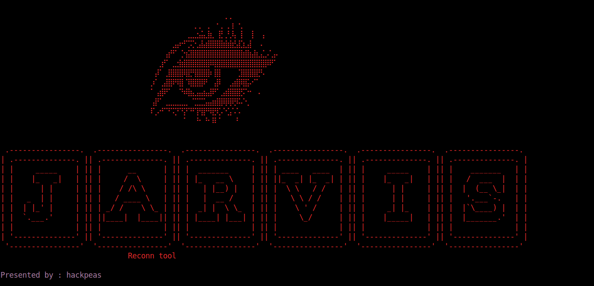
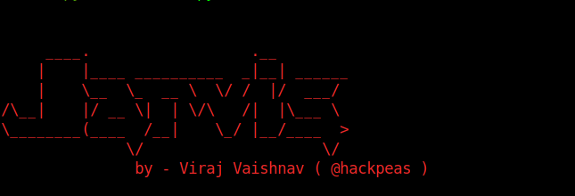

# Jarvis

## **Description**
### it is a cloud/container based tool for information gathering and reconnaissance purpose , it is a combination of python automation, cronjobs, docker, apache2 and aws cloud services,it consume little amount of data for single target, it is easy to launch , it will notify you via email about the Attack Status. run on aws ( EC2 , s3 bucket , etc) , it will also push all data to S3 Bucket

### Attack can be triger by using web portal of Jarvis

## What it will do 
- subdomain enumeration via many different tools like amass, subfinder, github-subdomain, sublist3r and assetfinder. so you won't miss any subdomain.
- directory brute force for 403 , and 404. check 404 for subdomain takeover.
- give a table for all alive subdomains along with their Status Code and title
- it will give set of urls for open redirect , SSRF , idor , sqli , rce. it uses gau and waybackurls for collecting all urls.
- it will give you a list of url possibly vulnerble for XSS, it also check for the parameter reflection.
- list out all aws s3 bucket linked to the target or used by target for importing any data via GET request , and do check for misconfigured buckets.
- check for s3 buckets for each subdomain, and also list out all the s3bucket names collected from the JS/HTML files.
- list out all web pages which are using WordPress and also do a check for enabled xmlrpc api.
- all the attack data will be stored in an s3 bucket so you can download it whenever you want.

# **Note**
### Currently the email notification is not working, since google has recently disabled access to inbox from less secure application. we are looking for alternative and will update here soon.

## Installation guide 
check this medium blog for the installation guide 
> https://hackpeas.medium.com/jarvis-automated-bug-hunting-tool-reconnaissance-tool-b8071d88ecc5

## How to use
Jarvis uses web portal to handle new attack, to provide current status, and to launch new attack, and to configure/reconfigure credentials
after the setup is done
you need to run start.sh script in the ec2 instance
> $ bash start.sh

and the web page will look like this

From now onwards, everything will be handled on web portal only

# Admin tab

This two sections are used to configure, S3 bucket, AWS user keys, and github TOKENSFILE.

# Attack status

This tab shown the current status of Jarvis, 
Jarvis consist of 3 VPS 
- subfinder 
- URL collector 
- Domain status 
- Git dorker

Git dorker is currently inactive.
but as the attack will start/running on any of vps, it will shown here.
you can also check the status of attack on page -> /current.txt

# Contact / About

From here, you can contact us, for any kinda assitance.

# Home

The first section is to launch new attack 

To launch the new attack, you just have to mention the target domain, say example.com and click on launch attack.
After the successful launch, keep your eye on attack-status tab, for the attack status. once the target domain is removed from pending of all the the vps, you can download the data.

## launching attack 

all the VPS works in an order -> first subfinder will launch -> after subfinder is done -> URL collector and Domain status checker will launch together
Note: Gitdorker is currently inactive.

Fill the target domain -> click on launch attack

In below image you can see, target comes under subfinder pending list

After few seconds, subfinder will start working and its state will change from Notworking to working

After subfinder will collect all the subdomains, and s3 bucket list, it will push it to the user defined s3 bucket, and initiate the attack for URL Collector and Domain Status checker VPS.

After few seconds, you can see a folder in your S3 bucket 

Consist of a file containing all enumerated subdomains 

Now, Subfinder work is almost done, and it will initiate the attack for other VPS at any moment, keep refreshing the attack status page

In above image, target is added in the pending list of both the remaining VPS, after few seconds we can see ( in below image), state of both the VPS is changed from Notworking to working

Same kinda status, you can also see at /current.txt 

Now here the attack is done, target is removed from all pending list, and all the VPS are in Notworking state

## Downloading the data collected from s3 bucket
you can download all the files, directly from the s3 bucket or use the download.py script for this task

in your local computer 

> $ git clone https://github.com/veer1024/jarvis.git && cd Jarvis
